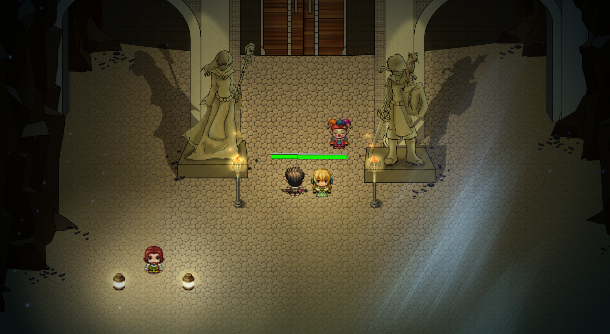
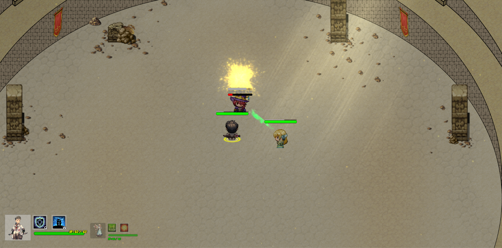
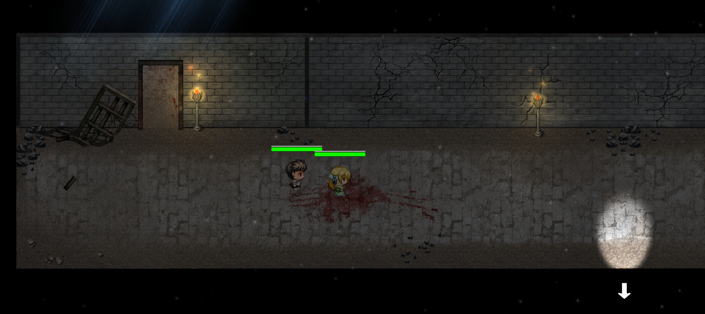

# _The Arena_ (previous title: _The Wall_)

[See a gameplay demo video here.](https://www.youtube.com/watch?v=tgpHvAOiN-0)

[See the wiki for a detailed history of the making of this game](https://github.com/keeganland/the-arena-agda/wiki)

_The Arena_ is an Action RPG developed in Unity by [Ryan Donnelly](https://github.com/ryanfd), [Alexandre Guichet](https://github.com/alexandreguichet), [Keegan Landrigan](https://github.com/keeganland), [Patric McConnell](https://github.com/PatricMc42), and Eloïse Zahabi. It began as a project in association with the [UBC AMS Game Development Association](http://www.amsgda.com/).

Special thanks to [Gowtham Mohan](https://bitbucket.org/Gowtham100/) for helping to get this project started.

## About _The Arena_

_The Arena_ plays like a Real-Time Strategy/RPG hybrid. The player controls two characters at once in real-time battles. The player needs to clear all battles in order to advance through the story/levels. 

The player has access to four different skills and an auto-attack. The good use of those skills is necessary to successfully complete puzzles and battles. The victory condition is to clear all battles and arrive at the end of the first floor. The failure condition is when both characters die at once. 

We currently have created a series of 3 battles in an arena and a dungeon floor. The arena itself contains a succession of tutorial battles where the player will progressively learn the core mechanics. The outside area of the arena is where the player learns how to interact with the world/NPCs. After completing the arena battles, the characters move on to a dungeon where they will be able to explore battle.

Much of the project has involved expanding our familiarity with team-based software development and software engineering outside of the scope available to us in a classroom setting. Furthermore, it involved acquiring significant number of technical skills not directly encountered in the classroom, such as proficiency with C#, Unity, and the Visual Studio IDE. Work on it has largely been an educational, exploratory experience as we discover for ourselves the capabilities of this toolset.

The final length of the game amounts to a short demo: 3 boss fights in the Arena itself and an additional fight in a dungeon area.

## Credits

Artwork in _The Arena_ is largely stock artwork taken from _RPG Maker MV_. 

## Technical Q&A

### Q: Running _The Arena_ within Unity works fine; why I am getting an error when I try to build the project?
A: /Assets/Scripts/MakeWeaponObject.cs is a script necessary for development processes, but causes problems at build time. It may be harmlessly surpressed when trying to build. 
